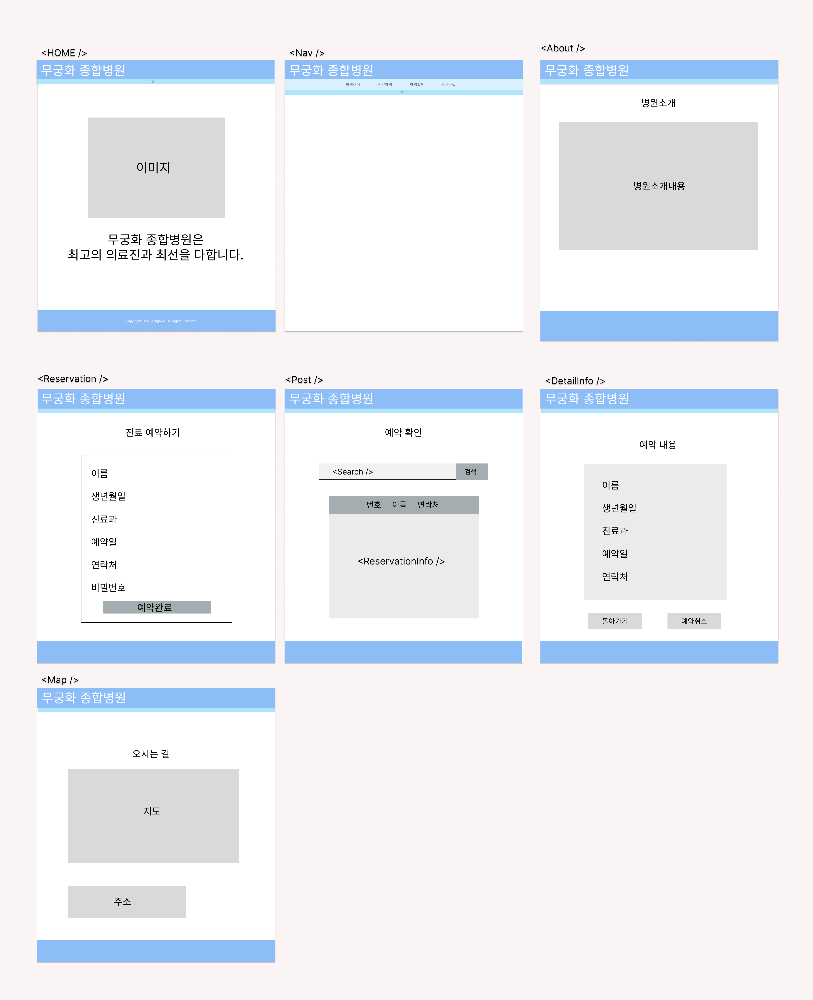

# Mini_SPA_Project

## 💡 프로젝트 소개
간단한 SPA 페이지로, 병원 예약 기능에 중점을 두어 만들었다. 
사용자는 병원 예약을 할 수 있고 자신이 예약한 내용을 비밀번호를 입력하고 확인할 수 있으며,
예약을 취소할 수 있다.  
  
  ## 💡 사용 스택
  - HTML5
  - CSS3
  - JavaScript
  - React

  ## 💡 디자인
  

  
  

  ## 💡 기능 설명
  
<a href="https://drive.google.com/file/d/1GOaCtZSrbtgtrvSQ8LYKooJvGuW46aV5/view?usp=sharing" target="_blank">기능 설명 보러가기</a>

  ## 💡 프로젝트를 통해 배운점
  ### 1. nav bar를 클릭하면 밑으로 내려오게 하고 싶은데 어떻게 하면 좋을까? 
   

   🙋‍♀️ css에 animation을 적용하고 싶었으나 어찌할 바를 모르다가 구글링을 통해class이름 역시 조건을 붙여 때에 따라 다르게 설정할 수 있다는 것을 알게되었고,
   class name값에 따라 animation을 달리 적용하여 nav bar에 원하는 효과를 줄 수 있었다. 
   그런데 className이 slide-up일 경우는 animation이 적용되지 않는 문제가 발생하였다. 
   toggle의 state값이 변하면서 페이지가 새로 랜더링 되어 toggle이 !false일 때 보이는 div가 사라졌기 때문이었다. 
   이 문제를 해결하기 위해 animation이 진행되고, toggle이 변하도록 setTimeout()를 적용하였다.
    

  ### 2. 예약일 설정할 때 주말을 제외하고 설정하고 싶은데 어떻게 하면 좋을까? 
  

  🙋‍♀️
  구글링을 하였는데 jquery datepicker를 사용하란 글이 많이 있었다.  혹시 react에도 datepicker가 있을까 싶어 검색해봤는데 있길래 설치하였고, 
  datepicker 홈페이지를 보며, 기존의 코드를 조금씩 수정하며 연구해서 내가 원하는 형태로 출력할 수 있었다.
  

  ### 3. 예약일 maxTime을 6시 30분으로 설정하고 싶은데 setHours와 setMinutes를 동시에 사용할 수 있는 방법이 없을까? 
  

  🙋‍♀️
  setHours(시간,분)을 사용하면 분까지 설정할 수 있다는 것을 깨달았다.
  

  ### 4. 예약 리스트에서 삭제 버튼 누르면 삭제되게 하려는데 어떻게 해야할까?
  

    🙋‍♀️
    우선 예약하기, 예약 리스트 모두와 같은 Data를 써야한다는 생각이 들었다.  처음엔 props로 연결되어 있지 않은 아이들은 어떻게 주고 받아야 할지 감이 잡히지 않았다.  
    고민 끝에 sessionStorage를 떠올렸고 sessionStorage를 많이 사용해보지 않아 처음엔 조금 버벅였지만 여러번의 시도 끝에 결국 원하는 대로 작동하였다. 
    이 기회를 통해 sessionStorage를 활용하는 방법에 대해 잘 알게 되었다.
  

## 💡 프로젝트 후 느낀점
  

  그동안은 학원에서 배웠던 것들을 중점으로 페이지를 만들었다면  이번엔 처음부터 기획, 설계를 다 하고
  배우지 않았던 것이라도 구글링을 통해 배워가며 적용시키려고 애썼다.  조금 헤매는 부분도 있고, 처음 생각했던 설계대로 실행되지 않은 부분도 있었지만 
  그래도 끝까지 혼자 힘으로 해내어 뿌듯하고 더 성장한 것 같아 기쁘다.
  

